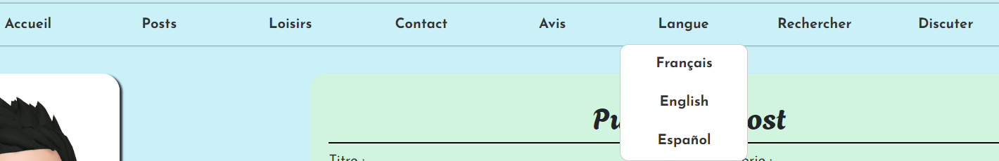

# mon-blog

## Présentation
Il s'agit d'un blog "personnel". On peut accéder à des articles sur différents sujets comme on peut ajouter des articles
(mot de passe: zarzis). Les lecteurs peuvent accéder à un post, rechercher un post en particulier ou publier un avis. [Vous pouvez consulter le site en cliquant ici](https://mon-blog-production.up.railway.app/) 

## Fonctionnalités
- Changer de langue: Le lecteur peut choisir une langue parmi les 3 proposées!
- Toutes les pages sont responsives
- Publier un avis
- Publier un article (mdp: zarzis)
- Rechercher un post et avoir une réponse générée à partir des résultats
- Discuter avec chatGPT à propos du contenu des articles

## Utilisation de ChatGPT 
ChatGPT a été une aide précieuse pour réaliser certaines tâches.
Voici la liste des problèmes où j'ai fait appel à chatGPT:
- Afficher un aperçu d'une image dans le panel admin
- Peupler la BD (Générer des avis et des posts sur différents sujets)
- Rappeler les étapes pour traduire les éléments statiques et ignorer certains dossiers (dossier venv)
- Traduire ces éléments (je lui donne le fichier Django.po et je lui demande de compléter avec les traductions)
- Proposer une solution pour que l'utilisateur puisse changer de langue facilement. Il m'a proposé une solution qui ne me convenait pas, à savoir ajouter des préfixes (fr/, en/) ce qui ne fonctionnait pas très bien. En regardant la documentation, (https://docs.djangoproject.com/fr/4.2/topics/i18n/translation/#the-set-language-redirect-view), je constate que je peux changer la langue en modifiant la valeur d'un cookie dont le nom peut être changé dans les paramètres (LANGUAGE_COOKIE_NAME)
- Implémenter une recherche RAG: Ne connaissant pas assez ce sujet, je lui ai demandé de me proposer un code pour générer une réponse basé sur un ensemble de documenets.

## Instructions sur la façon d'exécuter le projet et de tester la fonctionnalité multilingue.
Vous pouvez lancer (pour tester) avec la commande python manage.py runserver, après avoir installer toutes les dépendances dans requirements.txt. Cependant, si vous voulez le deployer, il est préférable d'utiliser la commande "gunicorn nom_du_projet.wsgi".
Pour changer la langue, il suffit d'aller dans le menu > langue et cliquer sur la langue souhaitée. La page rechargera et la version de la langue sélectionnée sera affichée. L'avantage avec le fait de ne pas rajouter de préfixe (fr/, en/, ...) est de pouvoir redirigé le visiteur sur la page sur laquelle il était facilement.

## Démonstration de l'intégration du chatbot et/ou de la fonctionnalité RAG
J'ai crée une classe qui gère tout ce qui est IA. Cette classe met en place un singleton (on suppose que dans le code, on fait appel à la méthode statique get_instance()) pour éviter la création de plusieurs instances ce qui entrainerai une perte de temps car le chargement des modèles prend du temps. Ensuite, on enregistre les articles déjà existant et pour chaque nouveau article on l'ajoute simplement sans devoir réajouter les autres grâce à un trigger:
```python
@receiver(post_save, sender=Post)
def trigger_ajouter_article(sender, instance, created, **kwargs):
    if created:
        BlogAI.get_instance(Post.objects.all()).ajouter_article(instance)
```

Cette classe n'est pas complète, puisqu'elle ne prend pas en compte les mise à jour d'articles ou la suppression d'articles. 
Bien évidement, ces problèmes n'ont pas été pris en compte car il fallait respecter un certain delail et rendre le projet
à temps. Ensuite, nous avons une méthode pour permettre de rechercher des articles grâce à la méthode du plus proche 
voisins et avoir une réponse générée en se basant sur un modèle.
```python
def rechercher_plus_proche_voisin(self, recherche):
    # On transforme la recherche en vecteur
    query_embedding = BlogAI.embed_text(recherche).reshape(1, -1)
    # Et on recherche les plus proches voisins
    distances, indices = self.index.search(query_embedding, BlogAI.k)
    resultat = [self.articles[int(i)] for i in indices[0]]
    # On génére une réponse à l'aide du modèle de langage
    context = " ".join([article.contenu for article in resultat])
    reponse = BlogAI.qr_pipeline(question=recherche, context=context)

    return resultat, reponse["answer"]
```
La recherche semble être plutôt efficace et les réponses sont satisfaisants en général. Voici une liste des recherches avec les réponses obtenues:
- Question: qui est le meilleur joueur du monde - Réponse: Lionel Messi 
- Question: quelle est le score du match real madrid barça - Réponse: 2 à 1
- Question: en quelle année a eu la ligue des champions - Réponse: 2024
- Question: en quelle année a eu la première ldc - Réponse: 1950
Bien sûr, il existe certaines recherches avec des réponses hors sujets ou incorrectes:
- Question: quelle est le jeu de course mentionné - Réponse: une expérience de jeu personnalisée
- Question: one piece - Réponse: </br>
Enfin, nous avons une méthode qui renvoie la réponse à une question passée en paramètre grâce à chatGPT et un prompt qui lui demande de se baser sur les articles du blog:
```python
def chatGPT(self, question):
    prompt = (f"En te basant sur les articles suivants, réponds à la question:"
              f"\n\n{self.text_articles}\n\nQuestion de l'utilisateur: {question}\nChatbot:")
    try:
        chat_completion = self.client.chat.completions.create(
            messages=[
                {
                    "role": "user",
                    "content": prompt,
                }
            ],
            model="gpt-3.5-turbo",
        )
        chatbot_response = chat_completion.choices[0].message.content
    except Exception as e:
        print(e)
        chatbot_response = "Erreur lors de la génération de la réponse"
    return chatbot_response
```

## Points négligés ou à améliorer
Il fallait rendre le projet avant une certaine date, ce qui entraîne la négligence de certains points. Voici une liste non exhaustive des points à améliorer :
- Mieux structurer le projet en créant plusieurs applications (IA, client, admin...)
- Améliorer la classe BlogAI (prendre en compte les anciens messages dans le prompt...)
- Personnaliser le site et la partie /admin/
- Factoriser le code de certaines parties du projet
- Changer la BD (ex: SQLite -> PostgreSQL)
- Mieux concevoir la base de données en créant par exemple une autre table Categories (et donc mettre une clé étrangère dans Post) afin de permettre à l'admin de créer d'autres catégories.  